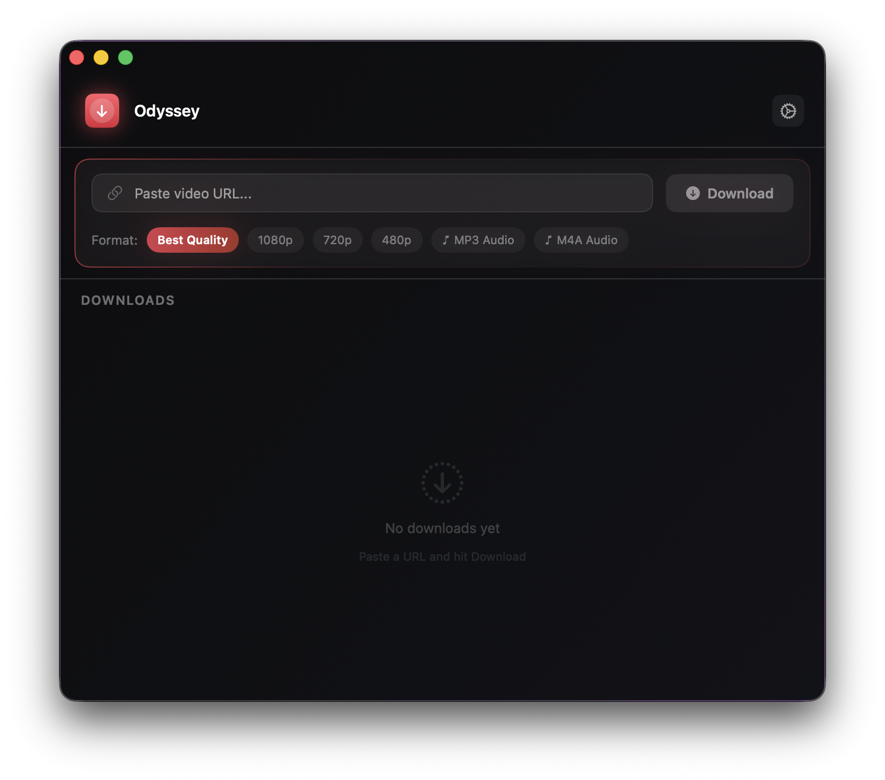
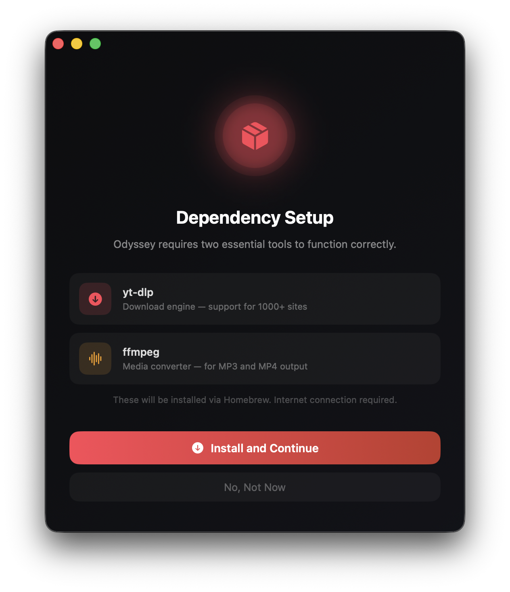
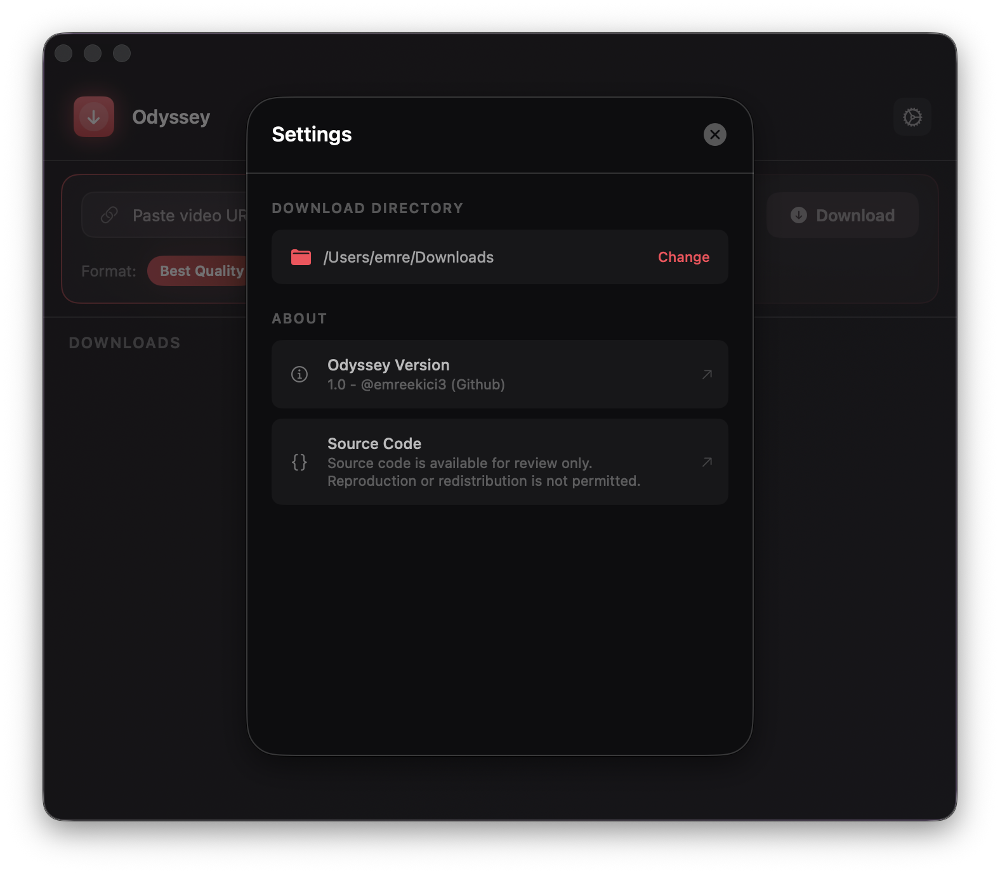

# 🌌 Odyssey

**Odyssey is a high-performance multimedia downloader for macOS, built with a native SwiftUI architecture. Designed for speed and minimal friction, it offers a refined dark-themed environment to archive online content with professional-grade reliability.**

  
  
  

## ✨ Features

- **Turbo-Charged Downloads:** Optimized for maximum bandwidth and stable performance.
- **Pure SwiftUI:** A lightweight, native macOS interface designed for the modern desktop.
- **Versatile Formats:** Seamlessly extract high-definition video or high-bitrate audio.
- **Automated Setup:** Intelligent dependency management to get you started in seconds.
  
## 🚀 Installation

1. Go to the [Releases](https://github.com/emreekici3/odyssey/releases) page.
2. Download the latest `Odyssey.dmg`.
3. Drag **Odyssey** to your `Applications` folder.

### 🛡️ Security Note
Since the app is not notarized by Apple, you may see a security warning on the first launch. 
To open the app:
1. **Right-click** on Odyssey.app in your Applications folder and select **Open**.
2. Or run this command in Terminal to bypass the warning:
   `xattr -d com.apple.quarantine /Applications/Odyssey.app`

## ⚠️ Legal Disclaimer & Responsibility

By using Odyssey, you agree to the following:

- **User Responsibility:** The user is solely responsible for any content downloaded using this software. 
- **Copyright Compliance:** Users must ensure they have the legal right or permission from the content owner before downloading any material. This tool is intended for personal use and archival purposes only.
- **No Liability:** The developer (@emreekici3) does not condone copyright infringement and is not liable for any misuse of the software or violations of terms of service of third-party websites.

## ⚖️ License

Copyright © 2026 @emreekici3. 
The source code is provided for educational and review purposes. Reproduction or redistribution of the code without permission is not permitted.

---
*Built with ❤️ for the macOS community.*
